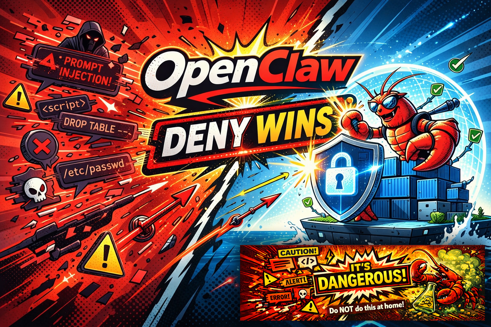

  

# OpenClaw Guide

A pragmatic, security-first guide to [OpenClaw](https://docs.openclaw.ai) — the AI agent platform that connects LLMs to messaging channels (WhatsApp, Signal, Slack, etc.) with tools, memory, and multi-agent routing.

**Live site:** [IT-HUSET.github.io/openclaw-guide](https://IT-HUSET.github.io/openclaw-guide/)

**Who this is for:** Anyone deploying OpenClaw who wants secure defaults, not just working defaults. Useful whether you're running a single personal assistant or a multi-agent setup with isolated web search and browser automation.

**Philosophy:** Secure by default, unlock capabilities progressively. Each phase builds on the previous one. Start with a working agent, then harden, then expand.

**Includes runnable security plugins:** Two OpenClaw plugins — [web-guard](extensions/web-guard/) and [channel-guard](extensions/channel-guard/) — that detect prompt injection in fetched web content and inbound channel messages using a local DeBERTa ONNX model. No API keys, no cloud dependencies. Drop them into any OpenClaw gateway.

**Based on:** OpenClaw 2026.2.x, macOS primary, Linux equivalents included. Covers WhatsApp, Signal, and Google Chat channels — for Telegram, Discord, Slack, and others see the [official docs](https://docs.openclaw.ai/channels).

---

## Security Plugins

Drop-in OpenClaw plugins that add prompt injection detection at two perimeters. Both use the same local DeBERTa ONNX model (~370 MB, downloaded on first use) — no API keys, no cloud calls.

- [`extensions/web-guard/`](extensions/web-guard/) — Intercepts `web_fetch` tool calls, pre-fetches the URL, and scans content for prompt injection before the agent sees it. Also blocks SSRF attempts to private/internal IPs. See [Phase 5 — web-guard](https://IT-HUSET.github.io/openclaw-guide/docs/phases/phase-5-web-search/#advanced-prompt-injection-guard).
- [`extensions/channel-guard/`](extensions/channel-guard/) — Scans inbound WhatsApp/Signal/Google Chat messages for prompt injection with three-tier response: pass, warn (inject advisory into agent context), or block. See [Phase 5 — channel-guard](https://IT-HUSET.github.io/openclaw-guide/docs/phases/phase-5-web-search/#inbound-message-guard-channel-guard).

## Other Extensions

- [`extensions/image-gen/`](extensions/image-gen/) — Image generation via OpenRouter API (FLUX, Gemini, GPT models). Requires `OPENROUTER_API_KEY`.

## Examples & Scripts

- [`examples/openclaw.json`](examples/openclaw.json) — Complete annotated config with core agents (main, search, browser) and optional channel agents (whatsapp, signal, googlechat), Docker sandboxing, and all security hardening applied
- [`examples/security-audit.md`](https://IT-HUSET.github.io/openclaw-guide/docs/examples/security-audit/) — Worked example of interpreting `openclaw security audit` output
- [`scripts/docker-isolation/`](scripts/docker-isolation/) — Three-script automated setup for Docker isolation deployment: host preparation, gateway configuration, and secrets management. See [Phase 6 — Docker isolation](https://IT-HUSET.github.io/openclaw-guide/docs/phases/phase-6-deployment/#docker-isolation).

---

## Quick Links

- [Official OpenClaw Docs](https://docs.openclaw.ai)
- [Security Docs](https://docs.openclaw.ai/gateway/security)
- [Sandboxing Docs](https://docs.openclaw.ai/gateway/sandboxing)
- [Multi-Agent Docs](https://docs.openclaw.ai/concepts/multi-agent)
