System architecture reference for [OpenClaw](https://docs.openclaw.ai) — covering core components, module dependencies, networking, and message flows.

> **Companion to the guide.** This document explains *how the system works internally*. For setup and configuration, see the [phase guides](phases/_index.md).

---

## System Overview

OpenClaw is a single-process Node.js gateway that connects LLM-powered agents to messaging channels, with tool execution, sandboxing, multi-agent routing, and a browser-based control UI — all multiplexed on one port.

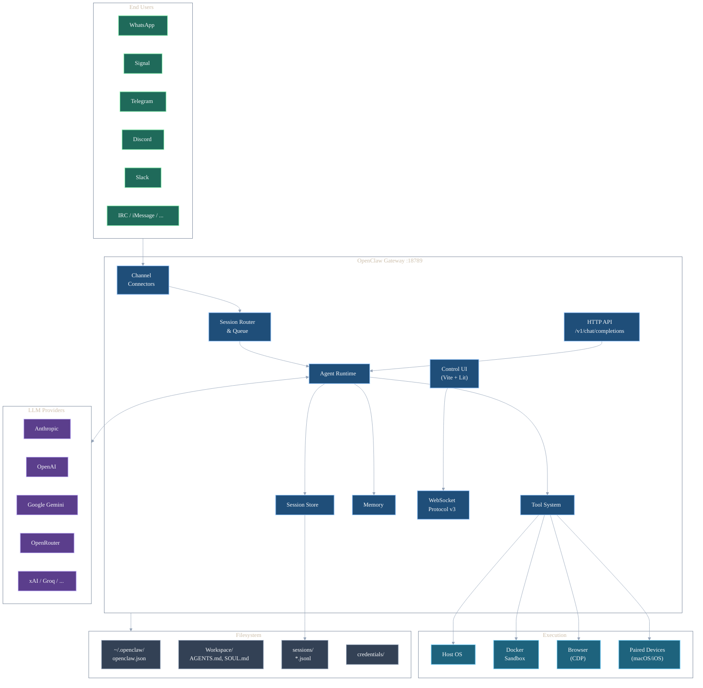

### Key Characteristics

- **Single process** — one Node.js process handles all agents, channels, sessions, and the control UI
- **Single port** — HTTP, WebSocket, and the control UI all multiplex on port `18789`
- **Multi-agent** — multiple isolated agents with separate workspaces, sessions, and auth profiles
- **Progressive security** — sandboxing, tool restrictions, and network isolation are opt-in layers

---

## Core Components

### Component Map

```mermaid
%%{init: { "theme": "base", "themeVariables": { "fontFamily": "ui-sans-serif, -apple-system, BlinkMacSystemFont, Segoe UI, Helvetica, Arial", "primaryColor": "#1F4E79", "primaryBorderColor": "#93C5FD", "primaryTextColor": "#F8FAFC", "lineColor": "#94A3B8", "secondaryColor": "#334155", "tertiaryColor": "#334155", "clusterBkg": "transparent", "clusterBorder": "#64748B", "background": "transparent" } }}%%
graph LR
    subgraph Core["Gateway Core"]
        CFG_SYS["Config System<br/>(JSON5 + hot reload)"]
        AUTH["Auth<br/>(token / password /<br/>Tailscale / device)"]
        RPC["RPC Framework<br/>(req/res/event)"]
    end

    subgraph Agents["Agent Layer"]
        RUNTIME["Agent Runtime"]
        BOOTSTRAP["Bootstrap Loader<br/>(AGENTS.md, SOUL.md,<br/>TOOLS.md, IDENTITY.md)"]
        CTX["Context Manager<br/>(pruning, compaction,<br/>memory flush)"]
    end

    subgraph Channels["Channel Layer"]
        WA_C["WhatsApp<br/>(Baileys)"]
        TG_C["Telegram<br/>(grammY)"]
        DC_C["Discord<br/>(Bot API)"]
        SL_C["Slack<br/>(Bolt SDK)"]
        SIG_C["Signal<br/>(signal-cli)"]
        MORE["15+ plugin<br/>channels"]
    end

    subgraph Sessions["Session Layer"]
        ROUTER["Binding Router"]
        QUEUE["Lane-Aware Queue<br/>(FIFO, debounce)"]
        STORE["Session Store<br/>(JSONL transcripts)"]
        SCOPE["Scope Resolver<br/>(main / per-peer /<br/>per-channel-peer)"]
    end

    subgraph Tools["Tool Layer"]
        BUILTIN["Built-in Tools<br/>(exec, read, write,<br/>edit, web_search, ...)"]
        BROWSER["Browser Control<br/>(CDP, multi-profile)"]
        SANDBOX["Sandbox Engine<br/>(Docker containers)"]
        PLUGINS["Plugin System<br/>(jiti, npm-installable)"]
    end

    subgraph Auto["Automation"]
        HOOKS["Hooks<br/>(event-driven)"]
        CRON["Cron Jobs"]
        WEBHOOKS["Webhooks"]
        HEARTBEAT["Heartbeats"]
    end

    Core --> Agents
    Core --> Channels
    Core --> Sessions
    Agents --> Tools
    Agents --> Sessions
    Channels --> Sessions
    Tools --> Auto

    classDef core fill:#1F4E79,stroke:#93C5FD,color:#F8FAFC,stroke-width:1.5px
    classDef agent fill:#1F6A5A,stroke:#86EFAC,color:#F8FAFC,stroke-width:1.5px
    classDef channel fill:#5B3E8C,stroke:#C4B5FD,color:#F8FAFC,stroke-width:1.5px
    classDef session fill:#334155,stroke:#94A3B8,color:#F8FAFC,stroke-width:1.5px
    classDef tool fill:#1E637D,stroke:#7DD3FC,color:#F8FAFC,stroke-width:1.5px
    classDef auto fill:#3730A3,stroke:#A5B4FC,color:#F8FAFC,stroke-width:1.5px

    class CFG_SYS,AUTH,RPC core
    class RUNTIME,BOOTSTRAP,CTX agent
    class WA_C,TG_C,DC_C,SL_C,SIG_C,MORE channel
    class ROUTER,QUEUE,STORE,SCOPE session
    class BUILTIN,BROWSER,SANDBOX,PLUGINS tool
    class HOOKS,CRON,WEBHOOKS,HEARTBEAT auto
```

### Component Details

| Component | Role | Key Config |
|-----------|------|------------|
| **Gateway Core** | Process lifecycle, config, auth, RPC | `gateway.port`, `gateway.bind`, `gateway.auth` |
| **Agent Runtime** | LLM interaction, tool orchestration, context management | `agents.list[]`, `agents.defaults.model` |
| **Channel Connectors** | Protocol adapters for each messaging platform | `channels.<type>.accounts` |
| **Session Router** | Maps inbound messages to agent + session key via bindings | `bindings[]`, DM scope config |
| **Queue** | Lane-aware FIFO with debounce, concurrency caps | `messages.queue.*` |
| **Tool System** | Tool dispatch with policy enforcement and sandboxing | `tools.allow/deny`, `sandbox.*` |
| **Plugin System** | TypeScript extensions loaded at runtime via jiti | `~/.openclaw/extensions/`, workspace `.openclaw/extensions/` |
| **Automation** | Hooks, cron, webhooks, heartbeats for event-driven behavior | `hooks/`, `cron[]`, `gateway.webhooks` |
| **Control UI** | Browser dashboard (Vite + Lit SPA) on same port | `http://127.0.0.1:18789/` |

---

## Module Dependencies

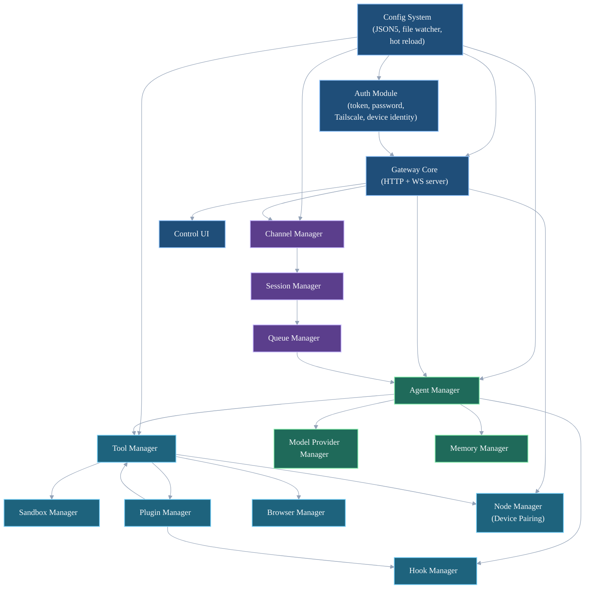

### External Dependencies

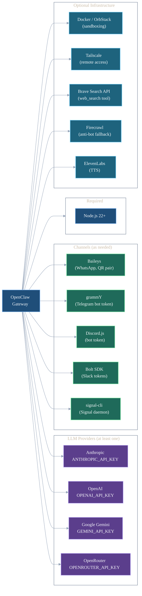

---

## Networking

### Port Architecture

OpenClaw multiplexes everything on a single port:

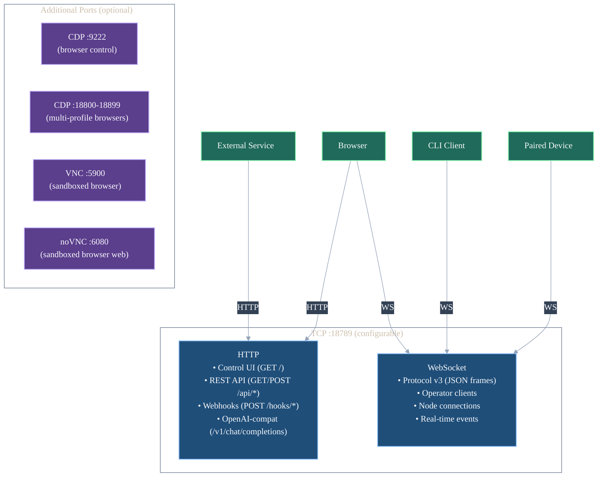

### Bind Modes

| Mode | Listens On | Auth Required | Use Case |
|------|-----------|---------------|----------|
| `loopback` | `127.0.0.1` | Optional | Local-only (default) |
| `tailnet` | Tailscale IP | **Yes** | Tailnet access without Serve |
| `lan` | `0.0.0.0` | **Yes** | LAN access |
| `custom` | Explicit interface/IP | **Yes** | Advanced/network-specific binds |
| `auto` | Prefers `127.0.0.1` | Depends | Auto-detect |

### Remote Access Patterns

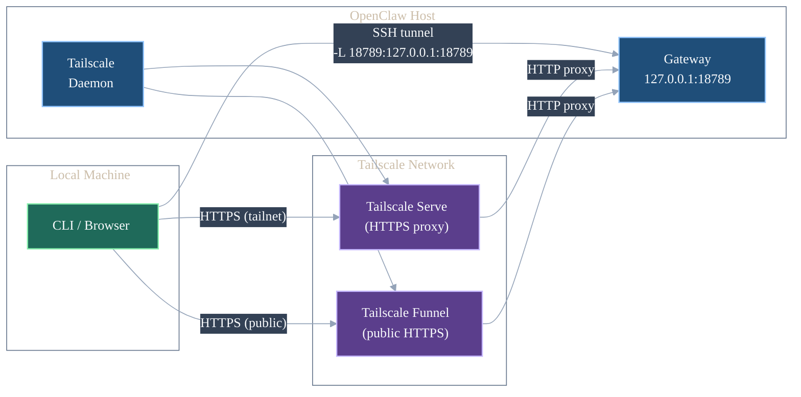

**Tailscale Serve** (recommended for remote access): gateway binds to loopback, Tailscale proxies HTTPS to your tailnet. Tailscale Serve automatically adds identity headers (`Tailscale-User-Login`, `Tailscale-User-Name`) to proxied requests when the connecting client is authenticated via Tailscale — no additional configuration required. OpenClaw uses these for passwordless auth.

**Tailscale Funnel**: public HTTPS endpoint (ports 443, 8443, 10000). Requires `gateway.auth.mode: "password"`.

**SSH tunnel**: simplest fallback — `ssh -N -L 18789:127.0.0.1:18789 user@host`.

### WebSocket Protocol v3

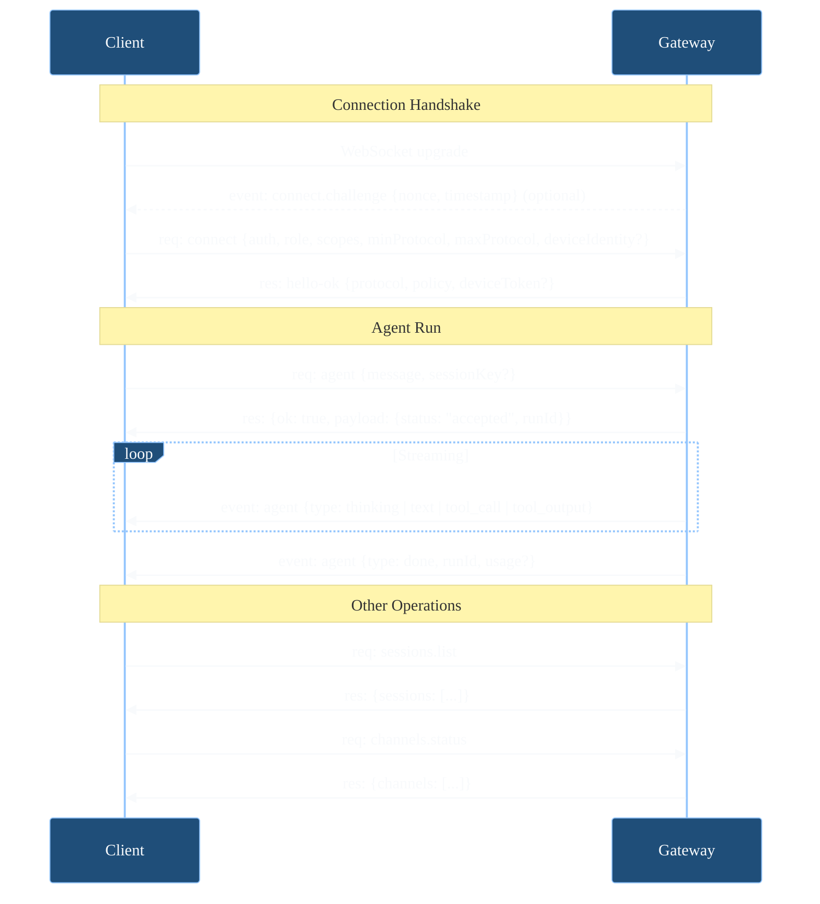

**Frame types:**
- **Request**: `{type:"req", id, method, params}` — client-initiated RPC call
- **Response**: `{type:"res", id, ok, payload|error}` — server reply
- **Event**: `{type:"event", event, payload, seq?, stateVersion?}` — server-pushed notification

---

## Message Flow

### Inbound: User to Agent

Full lifecycle of an incoming message (WhatsApp example):

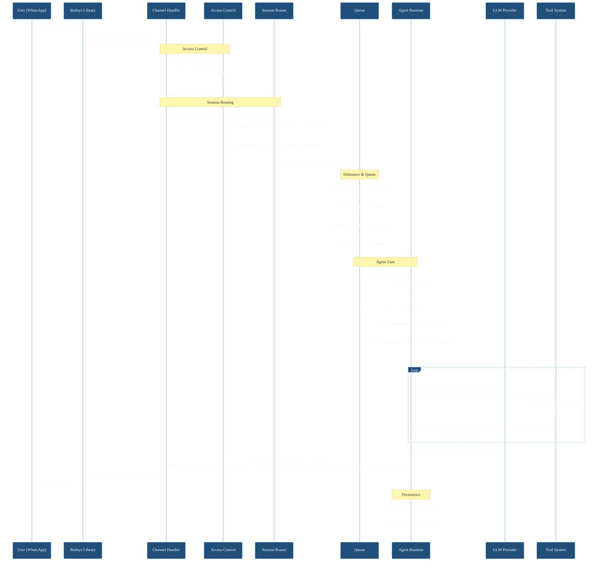

### Outbound: Agent Response Delivery

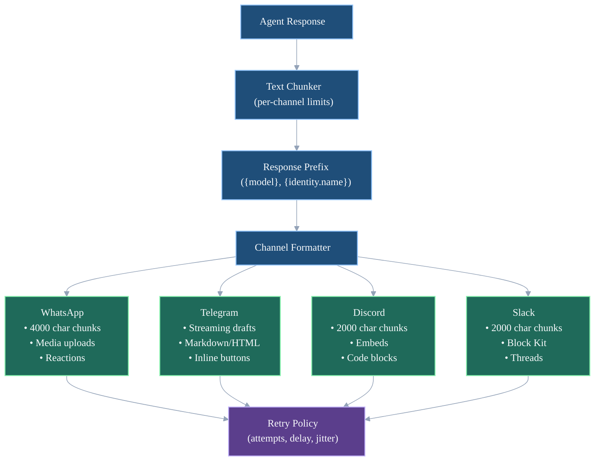

---

## Multi-Agent Routing

### Binding Resolution

When a message arrives, OpenClaw matches it against bindings with deterministic precedence:

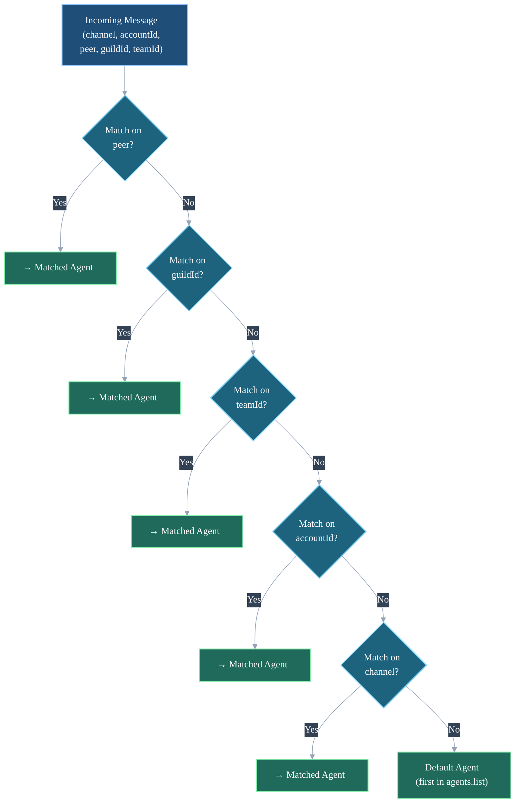

**Precedence**: peer (most specific) → guild → team → account → channel → default (least specific). First match wins.

### Agent Isolation Model

Each agent gets its own isolated runtime environment:

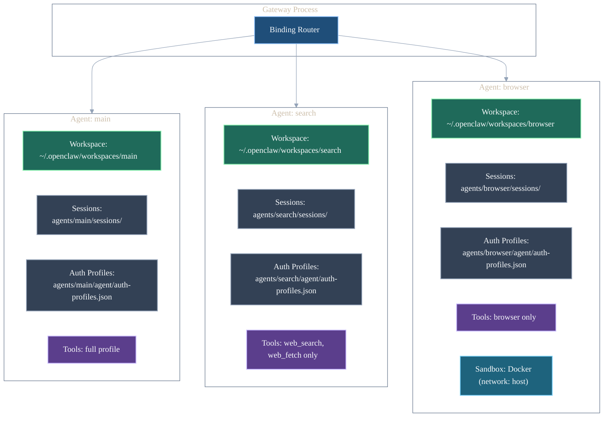

**What's isolated per agent:**
- Workspace directory (files, AGENTS.md, SOUL.md)
- Session store and transcripts
- Auth profiles (API keys, OAuth tokens)
- Tool allow/deny lists
- Sandbox configuration
- Memory store

---

## Sandbox Execution

### Docker Sandbox Architecture

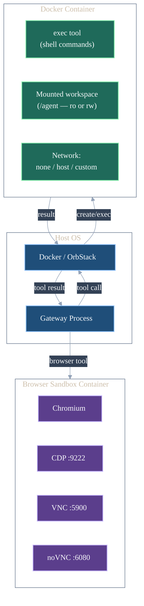

> **Browser egress risk:** The browser sandbox container requires full network access (`network: host`) for web browsing. A compromised browser agent could exfiltrate data to arbitrary hosts. Consider DNS filtering, proxy rules, or host firewall rules to limit this risk.

### Sandbox Modes

| Mode | Behavior |
|------|----------|
| `off` | All tools execute on host (default) |
| `non-main` | Sandbox for non-main sessions only |
| `all` | All tool execution in containers |

### Sandbox Scopes

| Scope | Container Lifecycle |
|-------|-------------------|
| `session` | One container per session (destroyed on session end) |
| `agent` | One container shared across all sessions for an agent |
| `shared` | One container shared across all agents |

### Sandbox Config Options

| Option | Values | Default |
|--------|--------|---------|
| `workspaceAccess` | `none`, `ro`, `rw` | `none` |
| `docker.network` | `none`, `host`, custom | `none` |
| `docker.readOnlyRoot` | `true`, `false` | `false` |
| `docker.image` | image name | `openclaw-sandbox:bookworm-slim` |

---

## Session Lifecycle

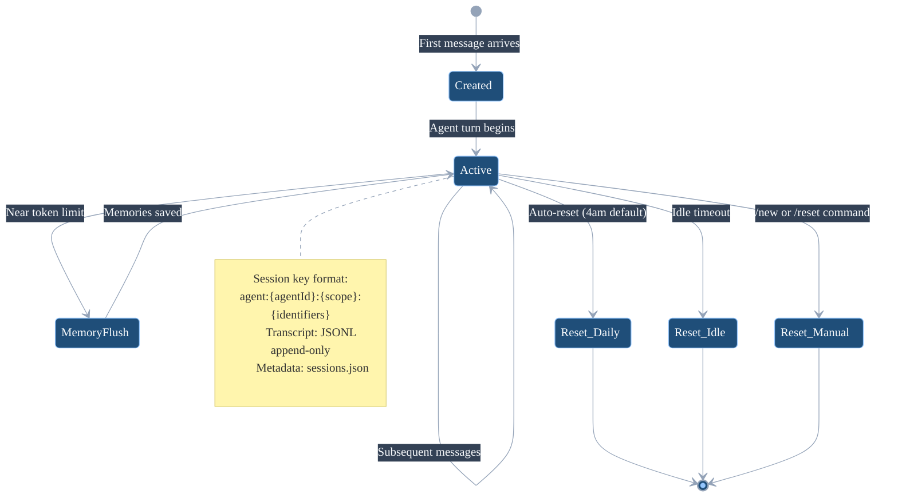

### Session Key Formats

| DM Scope | Key Pattern | Example |
|----------|-------------|---------|
| `main` | `agent:<id>:main` | `agent:main:main` |
| `per-peer` | `agent:<id>:dm:<peerId>` | `agent:main:dm:+46700000000` |
| `per-channel-peer` | `agent:<id>:<ch>:dm:<peerId>` | `agent:main:whatsapp:dm:+46700000000` |
| `per-account-channel-peer` | `agent:<id>:<ch>:<acct>:dm:<peerId>` | `agent:main:whatsapp:personal:dm:+46700000000` |

### Queue Processing

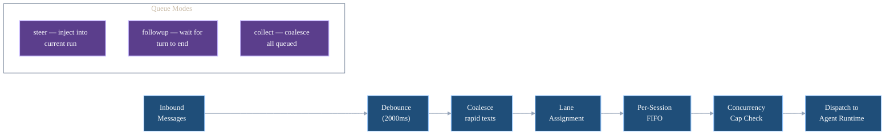

---

## Tool System

### Tool Policy Layers

Tool calls pass through multiple policy layers before execution (simplified — see [Reference: Tool Policy Precedence](reference.md#tool-policy-precedence) for the full 8-layer cascade):

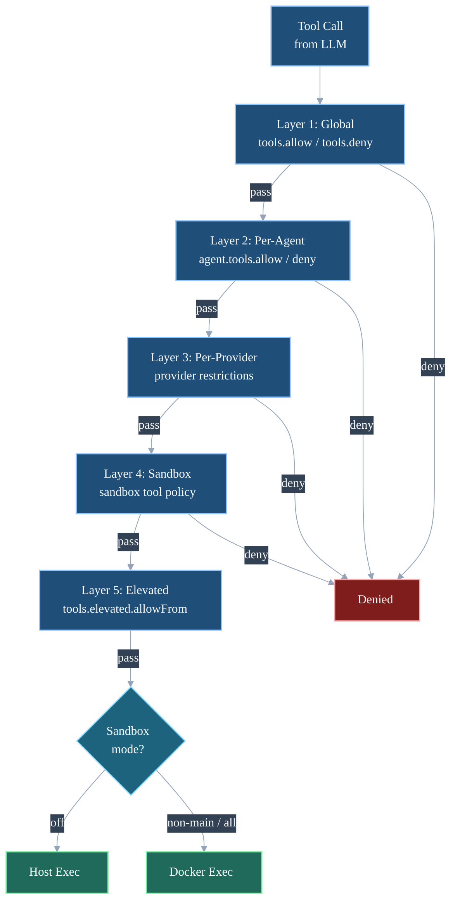

### Built-in Tool Groups

| Group | Tools |
|-------|-------|
| `group:runtime` | `exec`, `bash`, `process` |
| `group:fs` | `read`, `write`, `edit`, `apply_patch` |
| `group:sessions` | `sessions_list`, `sessions_history`, `sessions_send`, `sessions_spawn`, `session_status` |
| `group:memory` | `memory_search`, `memory_get` |
| `group:web` | `web_search`, `web_fetch` |
| `group:ui` | `browser`, `canvas` |
| `group:automation` | `cron`, `gateway` |
| `group:messaging` | `message` |
| `group:nodes` | `nodes` |
| `group:openclaw` | All built-in tools |

### Tool Profiles

| Profile | Includes |
|---------|----------|
| `minimal` | `session_status` |
| `coding` | `group:runtime`, `group:fs`, `group:sessions`, `group:memory` |
| `messaging` | `group:messaging`, `sessions_list`, `sessions_history`, `sessions_send`, `session_status` |
| `full` | `group:openclaw` (all built-in tools) |

---

## Plugin System

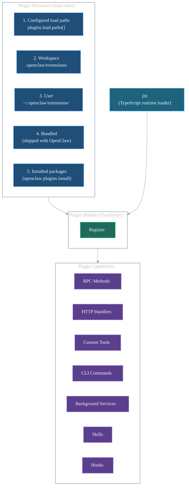

**Bundled plugins (disabled by default):** Google Antigravity OAuth, Gemini CLI OAuth, Qwen OAuth.

---

## Automation & Hooks

```mermaid
%%{init: { "theme": "base", "themeVariables": { "fontFamily": "ui-sans-serif, -apple-system, BlinkMacSystemFont, Segoe UI, Helvetica, Arial", "primaryColor": "#1F4E79", "primaryBorderColor": "#93C5FD", "primaryTextColor": "#F8FAFC", "lineColor": "#94A3B8", "secondaryColor": "#334155", "tertiaryColor": "#334155", "clusterBkg": "transparent", "clusterBorder": "#64748B", "background": "transparent" } }}%%
graph LR
    subgraph Triggers
        CMD["Commands<br/>(/new, /reset, ...)"]
        SESS_EVT["Session Events<br/>(start, end, compaction)"]
        AGENT_EVT["Agent Events<br/>(turn start/end)"]
        GW_EVT["Gateway Events<br/>(startup, shutdown)"]
        SCHED["Cron Schedule"]
        WH_IN["Inbound Webhook"]
    end

    subgraph Hooks["Hook System"]
        DISC["Hook Discovery<br/>workspace hooks/<br/>~/.openclaw/hooks/<br/>bundled"]
        HANDLER["Hook Handler<br/>(async TypeScript)"]
    end

    subgraph Actions
        MEM_SAVE["Save Memories"]
        LOG["Command Logger"]
        BOOT["Bootstrap Injection"]
        CUSTOM["Custom Logic"]
        AGENT_TURN["Trigger Agent Turn"]
    end

    Triggers --> DISC
    DISC --> HANDLER
    HANDLER --> Actions

    classDef trigger fill:#1F4E79,stroke:#93C5FD,color:#F8FAFC,stroke-width:1.5px
    classDef hook fill:#1F6A5A,stroke:#86EFAC,color:#F8FAFC,stroke-width:1.5px
    classDef action fill:#5B3E8C,stroke:#C4B5FD,color:#F8FAFC,stroke-width:1.5px

    class CMD,SESS_EVT,AGENT_EVT,GW_EVT,SCHED,WH_IN trigger
    class DISC,HANDLER hook
    class MEM_SAVE,LOG,BOOT,CUSTOM,AGENT_TURN action
```

**Bundled hooks:**
- `session-memory` — save session transcript to memory on `/new`
- `command-logger` — log all user commands
- `boot-md` — run `BOOT.md` on gateway startup
- `soul-evil` — (debug) inject adversarial system prompt

---

## Filesystem Layout

```
~/.openclaw/
├── openclaw.json              # Main config (JSON5)
├── workspace/                 # Single-agent workspace (Phase 1-3)
│   ├── AGENTS.md              # Operating procedures
│   ├── SOUL.md                # Identity, personality, values, boundaries
│   ├── TOOLS.md               # Environment-specific notes
│   ├── IDENTITY.md            # Agent name, creature, vibe, emoji
│   ├── USER.md                # About the human
│   ├── HEARTBEAT.md           # Proactive task checklist
│   ├── BOOTSTRAP.md           # First-run onboarding (self-deletes)
│   ├── BOOT.md                # Startup automation hooks
│   ├── memory/                # Persistent memories (markdown)
│   ├── skills/                # Custom skills
│   └── hooks/                 # Workspace-scoped hooks
├── workspaces/                # Multi-agent workspaces (Phase 4+)
│   ├── main/                  # Main agent workspace (same structure as above)
│   ├── whatsapp/              # Channel agent workspace
│   ├── signal/                # Channel agent workspace
│   ├── search/                # Search agent workspace (minimal)
│   └── browser/               # Browser agent workspace (minimal)
├── agents/
│   └── <agentId>/
│       ├── sessions/
│       │   ├── sessions.json  # Session store metadata
│       │   └── <sessionId>.jsonl  # Transcript
│       └── agent/
│           └── auth-profiles.json  # Per-agent auth
├── credentials/
│   └── whatsapp/
│       └── <accountId>/
│           └── creds.json     # WhatsApp credentials
├── extensions/                # User-installed plugins
├── hooks/                     # Global hooks
├── skills/                    # Global skills
└── identity/                  # Device identity keypair
```

---

## References

- [Official Docs](https://docs.openclaw.ai)
- [Configuration Reference](https://docs.openclaw.ai/gateway/configuration-reference)
- [Security](https://docs.openclaw.ai/gateway/security)
- [Sandboxing](https://docs.openclaw.ai/gateway/sandboxing)
- [Multi-Agent](https://docs.openclaw.ai/concepts/multi-agent)
- [Protocol](https://docs.openclaw.ai/gateway/protocol)
- [Tools](https://docs.openclaw.ai/tools)
- [Plugins](https://docs.openclaw.ai/tools/plugin)
- [Sessions](https://docs.openclaw.ai/concepts/session)
- [Queue](https://docs.openclaw.ai/concepts/queue)
- [Channels](https://docs.openclaw.ai/channels)
