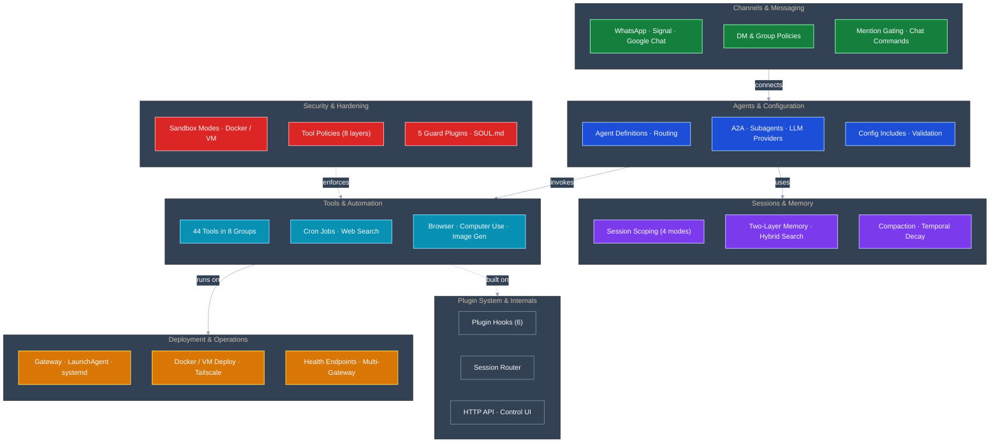

A structured map of every OpenClaw feature — organized by category, cross-referenced to guide sections, and annotated with known issues. Use this page to understand what's available, where to configure it, and what to watch out for.

## Feature Overview

> **Editable source:** The diagram is also available as an [Excalidraw file](https://github.com/IT-HUSET/openclaw-guide/blob/main/diagrams/feature-atlas-overview.excalidraw.json) — open it at [excalidraw.com](https://excalidraw.com) for a richer, editable version.

---

## Agents & Configuration

How agents are defined, routed, and connected to each other.

### Features

| Feature | Description | Config Key | Since | Guide |
|---------|-------------|------------|-------|-------|
| Agent definitions | Named agents with separate workspaces, tools, and model config | `agents.list[]` | — | [Phase 1](phases/phase-1-getting-started.md) |
| Agent defaults | Shared defaults inherited by all agents | `agents.defaults` | — | [Reference](reference.md#config-quick-reference) |
| Multi-agent routing | Bind channels/peers to specific agents via pattern matching | `bindings[]` | — | [Phase 4](phases/phase-4-multi-agent.md) |
| Workspaces | Per-agent directories with SOUL.md and AGENTS.md for behavioral constraints | `agents.list[].workspace` | — | [Phase 3](phases/phase-3-security.md) |
| Agent-to-agent (A2A) | Delegate tasks between agents via `sessions_send` | `tools.agentToAgent` | — | [Phase 4](phases/phase-4-multi-agent.md) |
| Subagents | Spawn background sub-tasks within an agent's session | `agents.defaults.subagents` | — | [Reference](reference.md#config-quick-reference) |
| Subagent limits | Control nesting depth and concurrency of spawned sub-agents | `subagents.maxSpawnDepth`, `maxChildrenPerAgent` | 2026.2.16 | [Reference](reference.md#config-quick-reference) |
| LLM providers | Multi-provider support (Anthropic, OpenAI, Gemini, OpenRouter, xAI, Groq) | `agents.list[].provider` | — | [Phase 1](phases/phase-1-getting-started.md) |
| LM Studio provider | Bundled local LM Studio provider with onboarding, runtime model discovery, stream preload, and memory-search embeddings for self-hosted OpenAI-compatible models | `models.providers.lmstudio` | 2026.4.12 | [Official docs](https://docs.openclaw.ai) |
| Self-hosted private network | Per-provider opt-in (`allowPrivateNetwork`) for trusted self-hosted OpenAI-compatible endpoints on private/loopback addresses | `models.providers.*.request.allowPrivateNetwork` | 2026.4.10 | [Official docs](https://docs.openclaw.ai) |
| Per-channel model overrides | Use different models for different channels | `channels.modelByChannel` | 2026.2.21 | [Reference](reference.md#config-quick-reference) |
| Skills | Bundled skill packages (coding-agent, github, healthcheck) | `skills.allowBundled` | — | [Reference](reference.md#config-quick-reference) |
| Config includes | Split config across multiple files with `$include` | `$include` | — | [Reference](reference.md#config-includes-include) |
| Per-agent thinking/reasoning defaults | Configure thinking/reasoning/fast mode per agent with automatic fallback | `agents.list[].defaults.think` | 2026.3.22 | [Reference](reference.md#config-quick-reference) |
| Native image generation model | Set the default model for the built-in `image_generate` tool | `agents.defaults.imageGenerationModel.primary` | 2026.3.22 | [Reference](reference.md#config-quick-reference) |
| Global default provider parameters | Set default provider parameters applied to all agents | `agents.defaults.params` | 2026.4.1 | [Reference](reference.md#config-quick-reference) |
| System prompt override | Controlled prompt experiments and heartbeat prompt-section controls | `agents.defaults.systemPromptOverride` | 2026.4.7 | [Reference](reference.md#config-quick-reference) |
| Local model lean mode (experimental) | Drop heavyweight default tools (`browser`, `cron`, `message`) to reduce prompt size for weaker local-model setups; has no effect on normal (non-local) paths | `agents.defaults.experimental.localModelLean: true` | 2026.4.15 | [Official docs](https://docs.openclaw.ai) |
| Config validation | Validate config before gateway startup | CLI: `openclaw config validate` | 2026.3.2 | [Reference](reference.md#config-validation) |
| Config schema | Print generated JSON schema for `openclaw.json` | CLI: `openclaw config schema` | 2026.3.28 | [Reference](reference.md#config-validation) |
| Environment files | `.env` loading from CWD → `~/.openclaw/` → config `env` block | `.env` files | — | [Reference](reference.md#environment-files) |

### Use Cases

- **Single agent with search delegation** — main agent + isolated search agent ([Phase 5](phases/phase-5-web-search.md))
- **Multi-channel routing** — separate agents per channel with binding patterns ([Phase 4](phases/phase-4-multi-agent.md))
- **Workspace isolation** — per-agent SOUL.md to enforce different behavioral rules ([Phase 3](phases/phase-3-security.md))
- **Config splitting** — `$include` for managing complex multi-agent configs ([Reference](reference.md#config-includes-include))

### Known Issues

| Issue | Status | Impact | Workaround |
|-------|--------|--------|------------|
| [#15176](https://github.com/openclaw/openclaw/pull/15176) — Channel bindings regression | Open | Bindings to non-default agents broken | Not relevant for recommended 2-agent config (all channels route to main) |
| [#9857](https://github.com/openclaw/openclaw/issues/9857) — `sessions_spawn` sandbox bug | Open | Both agents sandboxed with per-agent tools breaks spawn | Run search agent unsandboxed |
| [#14046](https://github.com/openclaw/openclaw/issues/14046) — ANNOUNCE_SKIP timing race | Open (PR [#15383](https://github.com/openclaw/openclaw/pull/15383)) | A2A `sessions_send` delivers despite `ANNOUNCE_SKIP` | None — message is delivered regardless |

---

## Channels & Messaging

How external users communicate with agents through messaging platforms.

### Features

| Feature | Description | Config Key | Since | Guide |
|---------|-------------|------------|-------|-------|
| WhatsApp | Full WhatsApp channel with DMs, groups, media, pairing | `channels.whatsapp` | — | [Phase 4](phases/phase-4-multi-agent.md) |
| Signal | Signal channel with DMs, groups, linked device support | `channels.signal` | — | [Phase 4](phases/phase-4-multi-agent.md) |
| Google Chat | Google Chat via GCP service account, DMs and spaces | `channels.googlechat` | — | [Google Chat](google-chat.md) |
| Telegram | Telegram channel (supported, not detailed in guide) | `channels.telegram` | — | [Official docs](https://docs.openclaw.ai) |
| Discord | Discord channel (supported, not detailed in guide) | `channels.discord` | — | [Official docs](https://docs.openclaw.ai) |
| Slack | Slack channel (supported, not detailed in guide) | `channels.slack` | — | [Official docs](https://docs.openclaw.ai) |
| DM policies | Control who can DM: pairing, allowlist, open, disabled | `channels.<ch>.dmPolicy` | — | [Reference](reference.md#dm-policy-options) |
| Group policies | Control group access: allowlist, open, disabled | `channels.<ch>.groupPolicy` | — | [Reference](reference.md#group-policy--mention-gating) |
| Mention gating | Require @mention before agent responds in groups | `channels.<ch>.groups.*.requireMention` | — | [Reference](reference.md#group-policy--mention-gating) |
| Mention patterns | Regex patterns for channels without native @mention (Signal) | `agents.list[].groupChat.mentionPatterns` | — | [Reference](reference.md#mention-patterns) |
| Chat commands | User-facing `/help`, `/reset`, `/status`, `/whoami`, `/compact`, `/stop` | — | — | [Reference](reference.md#chat-commands) |
| Directives | Session modifiers: `/think`, `/elevated`, `/model` | — | — | [Reference](reference.md#directives-session-modifiers) |
| Dangerous commands | Gated commands: `/bash`, `/config`, `/debug`, `/restart` | `commands.*` | — | [Reference](reference.md#dangerous-commands-disabled-by-default) |
| Proactive messaging | Send messages to any chat via `message` tool with explicit `target` | `message` tool | — | [Reference](reference.md#tool-list) |
| Per-channel models | Override LLM model per channel | `channels.modelByChannel` | 2026.2.21 | [Reference](reference.md#config-quick-reference) |
| Signal groups schema | Native groups config block for Signal channel | `channels.signal.groups` | 2026.3.13-1 | [Phase 6](phases/phase-6-deployment.md) |
| QQ Bot | QQ Bot bundled channel with multi-account, slash commands, reminders, and media | `channels.qqbot` | 2026.3.31 | [Official docs](https://docs.openclaw.ai) |
| WhatsApp emoji reactions | Agents can react to incoming WhatsApp messages with emoji; configure with `reactionLevel` | `channels.whatsapp.reactionLevel` | 2026.3.31 | [Official docs](https://docs.openclaw.ai) |
| Channel context visibility | Filter supplemental quote/thread/history context by sender allowlist per channel | `channels.<ch>.contextVisibility` | 2026.4.5 | [Official docs](https://docs.openclaw.ai) |

### Use Cases

- **WhatsApp personal assistant** — pairing-based DMs with group mention gating ([Phase 4](phases/phase-4-multi-agent.md))
- **Signal secure messaging** — privacy-focused channel with regex mention patterns ([Phase 4](phases/phase-4-multi-agent.md), [Phase 6](phases/phase-6-deployment.md))
- **Google Chat workspace bot** — GCP service account for team/org use ([Google Chat](google-chat.md))
- **Morning briefing delivery** — cron job with `delivery.to` for automated group reports ([Morning Briefing recipe](recipes/morning-briefing.md))
- **Multi-channel routing** — different agents respond on different channels ([Phase 4](phases/phase-4-multi-agent.md))

### Known Issues

| Issue | Status | Impact | Workaround |
|-------|--------|--------|------------|
| [#11758](https://github.com/openclaw/openclaw/issues/11758) — `requireMention` broken on WhatsApp (LID transition) | Open | `mentionedJids` use `@lid` format vs `selfJid` `@s.whatsapp.net` — mention detection always fails | Noted in [Phase 3](phases/phase-3-security.md); use group allowlist instead of mention gating |
| [#14046](https://github.com/openclaw/openclaw/issues/14046) — ANNOUNCE_SKIP timing race | Open (PR [#15383](https://github.com/openclaw/openclaw/pull/15383)) | Cron delivery proceeds despite agent returning ANNOUNCE_SKIP | None |

---

## Sessions & Memory

How conversations are scoped, persisted, and how agents remember across sessions.

### Features

| Feature | Description | Config Key | Since | Guide |
|---------|-------------|------------|-------|-------|
| Session scoping | Isolate conversations: main, per-peer, per-channel-peer, per-account-channel-peer | `session.dmScope` | — | [Sessions](sessions.md), [Reference](reference.md#session-scope-options) |
| Session lifecycle | Creation, compaction, pruning of session transcripts | — | — | [Sessions](sessions.md) |
| Session reset | Clear session via `/reset` command or CLI | `/reset` command, `openclaw sessions reset` | — | [Reference](reference.md#core-commands) |
| Session cleanup | Prune orphaned sessions and manage disk usage | `openclaw sessions cleanup` | 2026.2.23 | [Reference](reference.md#useful-commands) |
| Two-layer memory | Daily markdown files (auto-loaded today + yesterday) + semantic search for older | `agents.defaults.memorySearch` | — | [Phase 2](phases/phase-2-memory.md) |
| Local memory search | On-device embeddings via node-llama-cpp (no external API) | `memorySearch.provider: "local"` | — | [Phase 2](phases/phase-2-memory.md) |
| Remote memory search | External embedding provider (OpenAI, etc.) | `memorySearch.provider: "remote"` | — | [Phase 2](phases/phase-2-memory.md) |
| Hybrid search | Combine vector similarity + full-text search with configurable weights | `memorySearch.query.hybrid` | — | [Phase 2](phases/phase-2-memory.md) |
| MMR deduplication | Maximal Marginal Relevance to deduplicate similar search results | `memorySearch.query.hybrid.mmr` | — | [Phase 2](phases/phase-2-memory.md) |
| Temporal decay | Down-rank older memory entries with configurable half-life | `memorySearch.temporalDecay` | — | [Phase 2](phases/phase-2-memory.md) |
| Memory cache | In-memory cache for frequent search queries | `memorySearch.cache` | — | [Phase 2](phases/phase-2-memory.md) |
| Pre-compaction flush | Write memories before session compaction to prevent loss | `compaction.memoryFlush` | — | [Phase 2](phases/phase-2-memory.md) |
| Compaction tuning | Reserve tokens for response, keep recent context across compaction | `compaction.reserveTokens`, `keepRecentTokens` | 2026.2.21 | [Reference](reference.md#config-quick-reference) |
| Post-compaction reindexing | Immediate memory reindex after compaction for same-turn searchability | `compaction.postIndexSync`, `memorySearch.sync.sessions.postCompactionForce` | 2026.3.12 | [Phase 2](phases/phase-2-memory.md) |
| Multimodal memory indexing | Index images and audio in `extraPaths` via Gemini embeddings | `memorySearch.provider: "gemini"` + `gemini-embedding-2-preview` | 2026.3.11 | [Phase 2](phases/phase-2-memory.md) |
| QMD cross-agent collections | Opt specific agents into searching another agent's session history by name | `memorySearch.qmd.extraCollections` | 2026.3.31 | [Phase 2](phases/phase-2-memory.md) |
| Amazon Bedrock embeddings | Memory embeddings via Titan, Cohere, Nova, TwelveLabs; AWS credential-chain auto-detection | `memorySearch.provider: "bedrock"` | 2026.4.5 | [Phase 2](phases/phase-2-memory.md) |
| GitHub Copilot embeddings | Memory search embedding provider using GitHub Copilot transport with token refresh and remote override support | `memorySearch.provider: "copilot"` | 2026.4.15 | [Phase 2](phases/phase-2-memory.md) |
| LanceDB cloud storage | `memory-lancedb` backend supports remote object storage so durable memory indexes can run on cloud storage instead of local disk | `memory-lancedb` plugin | 2026.4.15 | [Official docs](https://docs.openclaw.ai) |
| Memory dreaming (experimental) | Background promotion of daily-log content into durable `MEMORY.md`; three phases (light, deep, REM) | `dreaming.enabled`, `dreaming.frequency` | 2026.4.5 | [Phase 2](phases/phase-2-memory.md) |
| Dreaming aging controls | Tune recall decay and promotion decisions | `dreaming.recencyHalfLifeDays`, `dreaming.maxAgeDays` | 2026.4.5 | [Phase 2](phases/phase-2-memory.md) |
| Dreaming separate storage (default) | Dreaming phase blocks (`## Light Sleep`, `## REM Sleep`) stored in `memory/dreaming/{phase}/YYYY-MM-DD.md` instead of inline in daily memory files — prevents daily notes from being dominated by structured candidate output; opt out by setting `storage.mode: "inline"` | `plugins.entries.memory-core.config.dreaming.storage.mode` | 2026.4.15 | [Phase 2](phases/phase-2-memory.md) |
| Dreaming REM tooling | Preview and explain promotion decisions; replay-safe reruns | `openclaw memory rem-harness`, `promote-explain` | 2026.4.5 | [Phase 2](phases/phase-2-memory.md) |
| Dreaming REM historical backfill | Replay old daily notes into Dreams and durable memory via `rem-harness --path` | `openclaw memory rem-harness --path` | 2026.4.9 | [Phase 2](phases/phase-2-memory.md) |
| Dreaming diary view | Structured diary view in Control UI with timeline, backfill/reset controls, and traceable summaries | Control UI | 2026.4.9 | [Phase 2](phases/phase-2-memory.md) |
| Dreaming ChatGPT import + memory-wiki | Import ChatGPT conversation history as source chats; `Imported Insights` and `Memory Palace` diary subtabs for inspecting compiled wiki pages and source pages | Control UI | 2026.4.11 | [Phase 2](phases/phase-2-memory.md) |
| Active Memory | Optional plugin that runs a dedicated memory sub-agent before each reply to automatically surface relevant context, preferences, and past details without requiring explicit "remember this" prompts; configurable message/recent/full context modes with `/verbose` inspection | `plugins.entries.active-memory` | 2026.4.10 | [Official docs](https://docs.openclaw.ai/concepts/active-memory) |
| Compaction notify user | Control whether the "🧹 Compacting context..." notice is shown | `agents.defaults.compaction.notifyUser` | 2026.4.2 | [Phase 2](phases/phase-2-memory.md) |
| Pluggable compaction provider | Replace built-in LLM summarization pipeline via plugin registry | `agents.defaults.compaction.provider` | 2026.4.7 | [Phase 2](phases/phase-2-memory.md) |
| Memory CLI | Status, index, search from terminal | `openclaw memory *` | — | [Reference](reference.md#useful-commands) |

### Use Cases

- **Personal assistant with long-term recall** — hybrid search with temporal decay ([Phase 2](phases/phase-2-memory.md))
- **Knowledge vault** — structured memory for research and reference material ([Knowledge Vault recipe](recipes/knowledge-vault.md))
- **Privacy-first memory** — local embeddings, no external API calls ([Phase 2](phases/phase-2-memory.md))
- **Multi-agent shared context** — agents in the same workspace share memory files ([Phase 4](phases/phase-4-multi-agent.md))

### Known Issues

No major open issues affecting sessions or memory.

---

## Security & Hardening

Layers of protection from sandbox isolation to network controls.

### Features

| Feature | Description | Config Key | Since | Guide |
|---------|-------------|------------|-------|-------|
| Sandbox modes | Container isolation: off, non-main, all | `agents.defaults.sandbox.mode` | — | [Reference](reference.md#sandbox-modes) |
| Sandbox scope | Isolate per-agent or per-session | `sandbox.scope` | — | [Reference](reference.md#sandbox-scope--access-guide) |
| Workspace access | Control sandbox filesystem access: none, ro, rw | `sandbox.workspaceAccess` | — | [Reference](reference.md#sandbox-scope--access-guide) |
| Sandbox tool allow list | Separate tool policy layer for sandboxed sessions | `tools.sandbox.tools.allow` | — | [Reference](reference.md#default-sandbox-tool-allow-list) |
| Docker isolation | Dedicated OS user + Docker sandboxing for agents | — | — | [Phase 6](phases/phase-6-deployment.md), [Scripts](https://github.com/IT-HUSET/openclaw-guide/tree/main/scripts/docker-isolation) |
| VM isolation (macOS) | macOS VMs via Lume for host isolation | — | — | [Phase 6](phases/phase-6-deployment.md) |
| VM isolation (Linux) | Linux VMs via Multipass/KVM with Docker inside | — | — | [Phase 6](phases/phase-6-deployment.md) |
| Tool policies | 8-layer cascade for tool allow/deny | `tools.*`, `agents.list[].tools.*` | — | [Reference](reference.md#tool-policy-precedence) |
| Tool profiles | Preset bundles: minimal, coding, messaging, full | `tools.profile` | — | [Reference](reference.md#tool-policy-precedence) |
| Elevated mode | Escape sandbox for trusted operations | `tools.elevated` | — | [Reference](reference.md#directives-session-modifiers) |
| content-guard | LLM-based prompt injection scanning at A2A boundary | Plugin config | 2026.2.1 | [Phase 5](phases/phase-5-web-search.md), [Extension](extensions/content-guard.md) |
| channel-guard | Inbound channel message injection scanning | Plugin config | — | [Extension](extensions/channel-guard.md) |
| file-guard | Path-based file access protection (no_access, read_only, no_delete) | Plugin config | — | [Extension](extensions/file-guard.md) |
| network-guard | Application-level domain allowlisting for web_fetch and exec | Plugin config | — | [Extension](extensions/network-guard.md) |
| command-guard | Regex-based dangerous command blocking for exec/bash | Plugin config | — | [Extension](extensions/command-guard.md) |
| SOUL.md | Agent behavioral constraints loaded at session start | Workspace file | — | [Phase 3](phases/phase-3-security.md) |
| Gateway auth | Token-based authentication for the gateway API | `gateway.auth` | — | [Phase 3](phases/phase-3-security.md) |
| Gateway auth auto-generation | Gateway generates a secure token if none is configured | — | 2026.2.19 | [Phase 3](phases/phase-3-security.md) |
| Secrets management | Audit, configure, apply, and reload secrets without restart | `openclaw secrets *` | 2026.2.26 | [Phase 6](phases/phase-6-deployment.md#secrets-management-all-methods) |
| Network egress control | OS-level firewall rules to restrict outbound connections | — | — | [Hardened Multi-Agent](hardened-multi-agent.md), [Scripts](https://github.com/IT-HUSET/openclaw-guide/tree/main/scripts/network-egress) |
| Security audit | CLI-driven security posture assessment | `openclaw security audit` | — | [Security Audit example](examples/security-audit.md) |
| SSRF hardening | Browser SSRF policy with private network controls | `browser.ssrfPolicy` | 2026.2.23 | [Phase 3](phases/phase-3-security.md) |
| Exec obfuscation detection | Detect and block obfuscated shell commands | — | 2026.2.23 | [Phase 3](phases/phase-3-security.md) |
| Exec safeBin path pinning | Pin trusted binary paths for exec allowlists | `tools.exec.safeBinTrustedDirs` | 2026.2.22 | [Reference](reference.md#config-quick-reference) |
| CSP enforcement | Content Security Policy for Control UI | — | 2026.2.16 | [Phase 3](phases/phase-3-security.md) |
| Workspace plugin auto-load disabled | Workspace-level plugins no longer auto-loaded (security hardening) | — | 2026.3.12 | [Phase 3](phases/phase-3-security.md) |
| Device pairing bootstrap tokens | Improved pairing token security for device bootstrap | — | 2026.3.12 | [Phase 3](phases/phase-3-security.md) |
| Exec inline eval hardening | Require fresh approval for inline interpreter eval (`python -c`, `node -e`, etc.) | `tools.exec.strictInlineEval` | 2026.3.22 | [Phase 3](phases/phase-3-security.md) |
| Marketplace manifest security | Remote marketplace manifests validated to prevent install-path expansion outside repo | — | 2026.3.22 | [Phase 3](phases/phase-3-security.md) |
| Exec env injection blocking | Block proxy, TLS, Docker endpoint, and package index env var overrides in host exec | — | 2026.3.31 | [Phase 3](phases/phase-3-security.md) |
| Plugin install fail-closed | Critical dangerous-code findings block plugin/skill install by default; override with `--dangerously-force-unsafe-install` | — | 2026.3.31 | [Phase 3](phases/phase-3-security.md) |
| Gateway auth hardening | trusted-proxy rejects mixed shared-token configs; local-direct fallback requires configured token | `gateway.auth` | 2026.3.31 | [Phase 6](phases/phase-6-deployment.md) |
| Runtime event trust hardening | Background notifyOnExit, ACP relays, and wake-hook payloads marked untrusted so they cannot inject System: text | — | 2026.4.7 | [Phase 3](phases/phase-3-security.md) |
| Plugin archive integrity | ClawHub downloads verified against version metadata SHA-256; fails closed on missing or malformed integrity data | — | 2026.4.7 | [Phase 3](phases/phase-3-security.md) |
| Gateway config exec write lock | model-facing `config.apply`/`config.patch` cannot change `safeBins`, `safeBinTrustedDirs`, or `strictInlineEval` (2026.4.7); extended in 2026.4.14 to block all flags enumerated by `openclaw security audit` | — | 2026.4.7 | [Phase 3](phases/phase-3-security.md) |
| Dotenv runtime-control env blocking | Workspace `.env` cannot override runtime-control or browser-control env vars | — | 2026.4.9 | [Phase 3](phases/phase-3-security.md) |
| Exec approval secret redaction | Secrets are redacted in exec approval prompts so inline approval review cannot leak credential material | — | 2026.4.15 | [Phase 3](phases/phase-3-security.md) |
| Gateway auth per-request resolution | Gateway bearer resolved per-request on all HTTP paths; token rotation via `secrets.reload` or config hot-reload takes effect immediately without restart | — | 2026.4.15 | [Phase 3](phases/phase-3-security.md) |
| Workspace file symlink hardening | `agents.files` API routes through `fs-safe` helpers; symlink aliases for agent files rejected; real-path resolved from file descriptor to prevent swap-between-open-and-realpath attacks | — | 2026.4.15 | [Phase 3](phases/phase-3-security.md) |

### Use Cases

- **Pragmatic single agent** — no Docker, guard plugins as the safety net ([Pragmatic Single Agent](pragmatic-single-agent.md))
- **Hardened multi-agent** — Docker sandbox + all five guard plugins + network egress ([Hardened Multi-Agent](hardened-multi-agent.md))
- **VM-based isolation** — strongest host separation for high-security deployments ([Phase 6](phases/phase-6-deployment.md))
- **Search agent isolation** — content-guard scans search results before they reach the main agent ([Phase 5](phases/phase-5-web-search.md))
- **Security audit** — automated posture check with `openclaw security audit --deep` ([Security Audit example](examples/security-audit.md))

### Known Issues

| Issue | Status | Impact | Workaround |
|-------|--------|--------|------------|
| [#9857](https://github.com/openclaw/openclaw/issues/9857) — `sessions_spawn` sandbox bug | Open | Can't sandbox both main and search agents with per-agent tools | Run search agent unsandboxed; tool policy provides isolation |

---

## Tools & Automation

The 44 built-in tools, cron scheduling, web search, browser, and extended capabilities.

### Features

| Feature | Description | Config Key | Since | Guide |
|---------|-------------|------------|-------|-------|
| Runtime tools | `exec`, `bash`, `process` — shell execution and process management | `group:runtime` | — | [Reference](reference.md#tool-list) |
| Filesystem tools | `read`, `write`, `edit`, `apply_patch` — file operations | `group:fs` | — | [Reference](reference.md#tool-list) |
| Session tools | `sessions_list`, `sessions_history`, `sessions_send`, `sessions_spawn`, `sessions_yield`, `session_status` | `group:sessions` | `sessions_yield`: 2026.3.12 | [Reference](reference.md#tool-list) |
| Memory tools | `memory_search`, `memory_get` — semantic search and retrieval | `group:memory` | — | [Reference](reference.md#tool-list) |
| Web tools | `web_search`, `web_fetch` — search and fetch web content | `group:web` | — | [Reference](reference.md#tool-list) |
| UI tools | `browser`, `canvas` — browser automation and artifact rendering | `group:ui` | — | [Reference](reference.md#tool-list) |
| Automation tools | `cron`, `gateway` — scheduling and gateway control | `group:automation` | — | [Reference](reference.md#tool-list) |
| Messaging tools | `message` — send messages to channels with explicit targets | `group:messaging` | — | [Reference](reference.md#tool-list) |
| Node tools | `nodes` — remote paired device operations | `group:nodes` | — | [Reference](reference.md#tool-list) |
| PDF tool | Read and extract content from PDF files | `pdf` tool | 2026.3.2 | [Reference](reference.md#tool-list) |
| Web search providers | Brave, Perplexity, xAI (Grok), Exa, Tavily, Firecrawl (bundled plugins), SearXNG (self-hosted) | `tools.web.search.provider`, `plugins.entries.exa/tavily/firecrawl` | Exa/Tavily/Firecrawl: 2026.3.22; SearXNG: 2026.4.1 | [Phase 5](phases/phase-5-web-search.md) |
| Browser automation | Playwright-based browser with CDP protocol | `browser` tool | — | [Reference](reference.md#tool-list) |
| Cron jobs (isolated) | Fresh throwaway session per run with optional channel delivery | `cron.jobs[].sessionTarget: "isolated"` | — | [Reference](reference.md#cron-jobs) |
| Cron jobs (main) | Inject events into agent's existing main session | `cron.jobs[].sessionTarget: "main"` | — | [Reference](reference.md#cron-jobs) |
| Cron delivery modes | announce (channel), none (silent), webhook (HTTP POST) | `cron.jobs[].delivery` | — | [Reference](reference.md#cron-jobs) |
| Cron webhook triggers | External triggers for cron jobs via authenticated webhook | `cron.webhookToken` | 2026.2.16 | [Reference](reference.md#config-quick-reference) |
| Cron notify | Deliver cron output to a channel peer | `cron.notify` | 2026.2.16 | [Reference](reference.md#config-quick-reference) |
| Cron per-job tool allowlist | Restrict which tools a cron job can use via `--tools` flag | `openclaw cron --tools` | 2026.4.1 | [Reference](reference.md#cron-jobs) |
| Background task flows | Unified background-run control plane with `openclaw flows list\|show\|cancel` | `openclaw flows` | 2026.3.31 | [Reference](reference.md#useful-commands) |
| Image generation (native) | Built-in image generation via `image_generate` tool | `agents.defaults.imageGenerationModel.primary` | 2026.3.22 | [Reference](reference.md#config-quick-reference) |
| Image generation (plugin) | Generate images via OpenRouter API (FLUX, Gemini, GPT, MiniMax image-01) | `generate_image` tool (image-gen plugin) | — (MiniMax: 2026.3.28) | [Extension](extensions/image-gen.md) |
| Video generation (native) | Built-in `video_generate` tool; providers include xAI, Alibaba Wan, Runway | `video_generate` tool | 2026.4.5 | [Official docs](https://docs.openclaw.ai) |
| Music generation (native) | Built-in `music_generate` tool; bundled Google Lyria and MiniMax providers; async delivery | `music_generate` tool | 2026.4.5 | [Official docs](https://docs.openclaw.ai) |
| ComfyUI workflows | Bundled `comfy` plugin for local/cloud ComfyUI; image, video, and music generation | `comfy` plugin | 2026.4.5 | [Official docs](https://docs.openclaw.ai) |
| Computer use | VM-based macOS interaction via 7 `vm_*` tools | `vm_*` tools (computer-use plugin) | — | [Phase 8](phases/phase-8-computer-use.md), [Extension](extensions/computer-use.md) |
| `openclaw infer` | First-class CLI hub for provider-backed inference workflows: model, media, web, and embedding tasks | `openclaw infer` | 2026.4.7 | [Official docs](https://docs.openclaw.ai) |
| Webhook ingress plugin | External automation creates and drives bound TaskFlows via per-route shared-secret endpoints | `plugins.entries.webhook-ingress` | 2026.4.7 | [Official docs](https://docs.openclaw.ai) |

### Use Cases

- **Isolated web search agent** — `web_search` + `web_fetch` on a dedicated agent, denied on main ([Phase 5](phases/phase-5-web-search.md))
- **Automated morning briefing** — cron job with isolated session + announce delivery ([Morning Briefing recipe](recipes/morning-briefing.md))
- **Knowledge vault management** — filesystem tools + memory for structured research ([Knowledge Vault recipe](recipes/knowledge-vault.md))
- **Image generation in chat** — `generate_image` tool via image-gen plugin ([Extension](extensions/image-gen.md))
- **VM computer automation** — execute tasks in a macOS VM via computer-use plugin ([Phase 8](phases/phase-8-computer-use.md))

### Known Issues

| Issue | Status | Impact | Workaround |
|-------|--------|--------|------------|
| [#14046](https://github.com/openclaw/openclaw/issues/14046) — ANNOUNCE_SKIP timing race in cron delivery | Open (PR [#15383](https://github.com/openclaw/openclaw/pull/15383)) | Agent returns ANNOUNCE_SKIP but delivery proceeds due to stale history | None |
| [#6535](https://github.com/openclaw/openclaw/issues/6535) — `after_tool_result` hook not wired | Open | Can't hook into tool results for post-processing | Use `before_tool_call` + pre-fetch pattern |

---

## Deployment & Operations

Running OpenClaw in production: service management, infrastructure, and day-to-day operations.

### Features

| Feature | Description | Config Key | Since | Guide |
|---------|-------------|------------|-------|-------|
| Gateway configuration | Mode, bind address, port, auth, hot-reload | `gateway.*` | — | [Reference](reference.md#config-quick-reference) |
| Config hot-reload | Automatic config reload without restart | `gateway.reload.mode: "auto"` | — | [Reference](reference.md#config-quick-reference) |
| LaunchAgent (macOS) | User-level service management via launchd | — | — | [Phase 6](phases/phase-6-deployment.md) |
| LaunchDaemon (macOS) | System-level hardened service (dedicated user, no shell) | — | — | [Phase 6](phases/phase-6-deployment.md) |
| systemd (Linux) | Linux service management with user or system units | — | — | [Phase 6](phases/phase-6-deployment.md) |
| Docker deployment | Containerized gateway with sandbox support | — | — | [Phase 6](phases/phase-6-deployment.md), [Scripts](https://github.com/IT-HUSET/openclaw-guide/tree/main/scripts/docker-isolation) |
| VM deployment (macOS) | Lume / Parallels VMs for strongest host isolation | — | — | [Phase 6](phases/phase-6-deployment.md) |
| VM deployment (Linux) | Multipass / KVM VMs with Docker inside | — | — | [Phase 6](phases/phase-6-deployment.md) |
| Tailscale | Remote access via WireGuard mesh network | — | — | [Phase 6](phases/phase-6-deployment.md) |
| Health endpoints | `/health`, `/healthz`, `/ready`, `/readyz` for monitoring | — | 2026.3.1 | [Reference](reference.md#version-compatibility) |
| Logging | Configurable redaction and file size caps | `logging.*` | maxFileBytes: 2026.2.22 | [Reference](reference.md#config-quick-reference) |
| Migration | Move deployment to new machine (config, creds, memory, channels) | — | — | [Phase 7](phases/phase-7-migration.md) |
| Multi-gateway (profiles) | Multiple gateway configs via `--profile` flag | — | — | [Multi-Gateway](multi-gateway.md) |
| Multi-gateway (multi-user) | Separate OS users per gateway instance | — | — | [Multi-Gateway](multi-gateway.md) |
| Multi-gateway (VM variants) | One VM per channel for maximum isolation | — | — | [Multi-Gateway](multi-gateway.md) |
| Custom sandbox images | Build Docker images with pre-installed tools | — | — | [Custom Sandbox Images](custom-sandbox-images.md) |
| Diagnostics | `openclaw doctor`, `openclaw doctor --fix` | — | — | [Reference](reference.md#useful-commands) |
| Light context heartbeat | Reduced context for heartbeat cycles to save tokens | `agents.*.heartbeat.lightContext` | 2026.3.1 | [Reference](reference.md#version-compatibility) |
| Docker timezone support | `OPENCLAW_TZ` environment variable for container timezone | `OPENCLAW_TZ` env var | 2026.3.13-1 | [Phase 6](phases/phase-6-deployment.md) |
| Node.js version guard | Runtime enforces Node.js 22.14+ minimum (Node 24 recommended) | — | 2026.3.13-1 (lowered 2026.3.24) | [Phase 1](phases/phase-1-getting-started.md) |

### Use Cases

- **Single-machine production** — LaunchAgent + Docker sandbox + Tailscale ([Phase 6](phases/phase-6-deployment.md))
- **Hardened daemon** — LaunchDaemon with dedicated user, no login shell ([Phase 6](phases/phase-6-deployment.md))
- **Multi-user setup** — separate OS users per gateway for channel separation ([Multi-Gateway](multi-gateway.md))
- **Machine migration** — step-by-step procedure for moving everything to new hardware ([Phase 7](phases/phase-7-migration.md))
- **Custom tooling** — pre-built sandbox images with project-specific packages ([Custom Sandbox Images](custom-sandbox-images.md))

### Known Issues

No major open issues affecting deployment.

---

## Internals

### Plugin System & Architecture

How the gateway works under the hood — the module system, plugin lifecycle, and extension points.

#### Features

| Feature | Description | Config Key | Since | Guide |
|---------|-------------|------------|-------|-------|
| `before_dispatch` hook | Intercept inbound messages before routing with canonical metadata | Plugin API | 2026.3.24 | [Reference](reference.md#plugin-hooks) |
| `before_tool_call` hook | Intercept tool calls before execution; supports async `requireApproval` to pause for user confirmation (used by content-guard, network-guard) | Plugin API | 2026.2.1 (`requireApproval`: 2026.3.28) | [Reference](reference.md#plugin-hooks) |
| `before_agent_reply` hook | Short-circuit the LLM with synthetic replies after inline actions | Plugin API | 2026.4.2 | [Reference](reference.md#plugin-hooks) |
| `message_received` hook | Intercept incoming channel messages (used by channel-guard) | Plugin API | — | [Reference](reference.md#plugin-hooks) |
| `llm_input` hook | Intercept prompts before sending to model | Plugin API | 2026.2.16 | [Reference](reference.md#plugin-hooks) |
| `llm_output` hook | Intercept model responses after receiving | Plugin API | 2026.2.16 | [Reference](reference.md#plugin-hooks) |
| Plugin SDK | Public plugin SDK surface via `openclaw/plugin-sdk/*` subpaths (`openclaw/extension-api` removed) | `openclaw/plugin-sdk/*` | 2026.3.22 | [Reference](reference.md#plugin-installation) |
| Plugin discovery | Workspace → user-level → bundled; first match wins | `~/.openclaw/extensions/` | — | [Reference](reference.md#plugin-installation) |
| Plugin allow/deny | Allowlist + per-plugin enabled flag; both must pass | `plugins.allow`, `plugins.entries.*.enabled` | — | [Reference](reference.md#plugins) |
| Plugin tool registration | Plugins can register custom tools (image-gen → `generate_image`, computer-use → `vm_*`) | Plugin API | — | [Reference](reference.md#plugins) |
| Plugin configuration | Per-plugin config block with model, thresholds, timeouts | `plugins.entries.*` | — | [Reference](reference.md#plugin-installation) |
| Single-process gateway | Node.js process handling all agents, channels, sessions, and UI | — | — | [Architecture](architecture.md) |
| Session router & queue | Route incoming messages to the correct agent session | — | — | [Architecture](architecture.md), [Sessions](sessions.md) |
| Channel connectors | Protocol adapters for each messaging platform | — | — | [Architecture](architecture.md) |
| WebSocket protocol v3 | Real-time streaming for Control UI and HTTP API | — | — | [Architecture](architecture.md) |
| HTTP API | OpenAI-compatible `/v1/chat/completions` endpoint | `gateway.*` | — | [Architecture](architecture.md) |
| Control UI | Browser-based operator interface (Vite + Lit) | — | — | [Architecture](architecture.md) |
| Control UI Model Auth status | Overview card showing OAuth token health and provider rate-limit pressure; attention callouts when tokens are expiring or expired; backed by `models.authStatus` gateway method (cached 60s, credentials stripped) | Control UI overview | 2026.4.15 | [Official docs](https://docs.openclaw.ai) |
| mDNS discovery | Local network service discovery | `discovery.mdns` | — | [Reference](reference.md#config-quick-reference) |
| Tool system | Unified tool dispatch with policy enforcement | — | — | [Architecture](architecture.md) |

#### Use Cases

- **Custom guard plugin** — use `before_tool_call` hook to intercept and validate tool calls ([Extension docs](extensions/))
- **Input/output logging** — `llm_input`/`llm_output` hooks for compliance and auditing ([Reference](reference.md#plugin-hooks))
- **Custom tool plugin** — register new tools accessible by agents (e.g., image-gen, computer-use) ([Extension docs](extensions/))
- **API integration** — use the HTTP API for programmatic agent interaction ([Architecture](architecture.md))

#### Known Issues

| Issue | Status | Impact | Workaround |
|-------|--------|--------|------------|
| [#6535](https://github.com/openclaw/openclaw/issues/6535) — `after_tool_result` hook not wired | Open | Can't hook into tool results for post-processing or content scanning | Use `before_tool_call` + pre-fetch pattern for content scanning |
